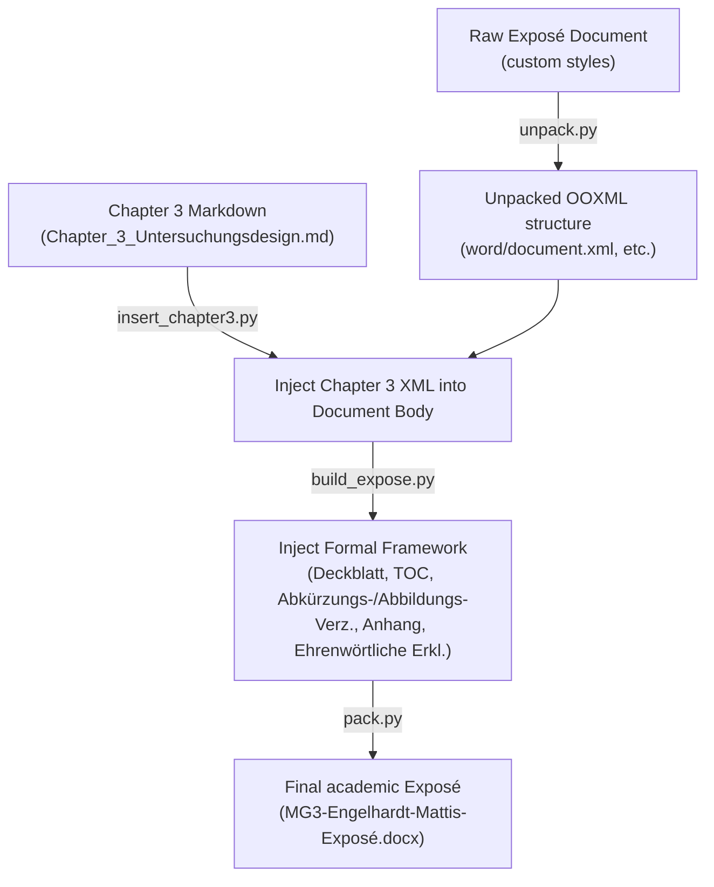

# 🚀 AI-Agentic Academic Writing Workspace

[](https://www.hfwu.de/)
[](CLAUDE.md)
[](scripts/)
[](scripts/)

This repository showcases a state-of-the-art **AI-agentic academic writing workspace** utilized to research, plan, write, and format a premium seminar paper (Exposé) for the module **Methodische Grundlagen III (MG3)** at **HfWU Nürtingen-Geislingen**. 

The research is centered around the highly relevant question:
> *„Welche Rolle spielt KI in der Gründungsphase von B2C-E-Commerce-Startups zur Stärkung des Unit-Profitability-First-Gedankens?"*  
> *(What role does AI play in the founding phase of B2C E-Commerce startups to strengthen the "Unit-Profitability-First" mindset?)*

---

## 🌟 The Core Paradigm: Agentic & Rule-Based AI Writing

Unlike simple, single-prompt AI generation which often results in superficial, repetitive, or poorly-cited text, this project implements a **highly structured, multi-phase AI-agentic writing pipeline**.

### 🧠 The Central Brain: [CLAUDE.md](CLAUDE.md)
At the very heart of this workspace is **[CLAUDE.md](CLAUDE.md)**—the *Operational Control Document*. It acts as the "system brain" and rule-enforcement engine. Every AI agent participating in the writing or formatting of this exposé was strictly bound by this document. 

Key responsibilities of [CLAUDE.md](CLAUDE.md) include:
*   **Source Partitioning**: Strictly separating source classes (the 10 literature review sources are *never* mixed with the methodological source *Döring (2023)*).
*   **Forbidden Actions**: Hard boundaries on actions (e.g., zero empirical data hallucination, no citations from abstract/introduction).
*   **Citation Validation**: Strict rule enforcement on in-text citations and exact page matching.
*   **KI-Dokumentation Rules**: Strict rules on how AI usage must be logged and cited in-text (to satisfy academic integrity and prevent plagiarism).

---

## 🔗 The 8-Step Prompt Chaining Pipeline

The entire paper was written using a systematic prompt chain to break down cognitive tasks and ensure academic excellence. Every prompt used is documented and available in both `.docx` and human-readable Markdown format:

| Step | Phase | Purpose | Artifacts |
| :--- | :--- | :--- | :--- |
| **1** | **Planning & Framework** | Systematically analyzes all raw sources and builds the operational blueprint ([CLAUDE.md](CLAUDE.md)). | 📝 [Prompt 1](prompts/Prompt%201%20Workflow%20und%20MD%20Datei.md) |
| **1.5** | **Citation Pre-Research** | Systematically scans the 10 core literature sources to find high-value, zitable passages. | 📝 [Prompt 1.5](prompts/Prompt%201.5%20Vorarbeit%20Einleitung.md) |
| **2** | **Introduction Writing** | Crafts the 1-page Academic Introduction using a Macro-to-Micro funnel approach. | 📝 [Prompt 2](prompts/Prompt%202%20Einleitung%20schreiben.md) |
| **3** | **Literature Synthesizing** | Builds a comprehensive comparison map of the 10 sources, outlining gaps. | 📝 [Prompt 3](prompts/Prompt%203%20Synthese%20Plan.md) |
| **3.5** | **Literature Review** | Formulates the comparative Literature Review (4 pages) utilizing dynamic capability frameworks. | 📝 [Prompt 3.5](prompts/Prompt%203.5%20Literature%20Review.md) |
| **4** | **Methodology Scavenging** | Deep-dives into the 1,100-page *Döring (2023)* textbook to extract exact methodological quotes. | 📝 [Prompt 4](prompts/Prompt%204%20Untersuchungsdesign%20Tiefenrecherche.md) |
| **5** | **Methodology Structuring** | Creates the structural blueprint for Chapter 3 (Research Design). | 📝 [Prompt 5](prompts/Prompt%205.md) |
| **6** | **Research Design Writing** | Writes the 5-page Research Design, mapping the 7 critical dimensions of empirical studies. | 📝 [Prompt 6](prompts/Prompt%206.md) |

---

## 🛠️ The XML-Patching & Build Pipeline (Python Automation)

One of the most complex challenges in AI-aided document assembly is **preserving MS Word styles, formatting, layout, and page-numbering behaviors**. Traditional Python `docx` libraries frequently corrupt custom stylesheets, headers, and specific section configurations.

To solve this, this repository includes a custom **unpacker/packer XML-patching system** in the [scripts/](scripts/) directory:



### 🧬 Automation Scripts Overview
*   **[`insert_chapter3.py`](scripts/insert_chapter3.py)**: Dynamically parses the raw markdown output of the Research Design, escapes symbols according to OOXML standards, and cleanly inserts it into the document body with correct heading levels (`berschrift1`/`berschrift2`).
*   **[`build_expose.py`](scripts/build_expose.py)**: Operates directly on the XML files. It generates a multi-section document layout that:
    1. Prepends a zentriertes HfWU-Logo cover page and a clean Research Question page (no page numbers).
    2. Builds an auto-generated Table of Contents, Abbreviation list, and Gender Disclaimer in a section configured with **lowercase Roman page numbers** (`I, II, III...`).
    3. Appends a hanging-indent Bibliography, Appendix Table, and signed Declaration in a section that carries over **decimal page numbers** (`1, 2, 3...`) from the main text body.
*   **[`batch_marker.py`](scripts/batch_marker.py)** & **[`batch_pymupdf.py`](scripts/batch_pymupdf.py)**: Batch processing scripts to convert large PDF files into clean Markdown for context-window-friendly prompt injections.

---

## 📁 Repository Structure

```
├── .gitignore                          # Excludes large literature PDFs, virtualenvs, and temp files
├── README.md                           # Main English documentation and workflow overview
├── CLAUDE.md                           # Operational Control Document (Core AI Rule Engine)
├── Literaturlandkarte.jpg              # Visual mapping of E-Commerce & AI literature relationships
├── Synthese_Plan_Literature_Review.md # Deep synthesis matrix of the 10 main literature sources
├── Seitenzahlen_Verifizierung.md       # Empirical verification logs for Döring textbook citations
├── Uebergabe_Untersuchungsdesign_Optimierung.md # Handover and optimisation logs
├── paper/                              # Final generated academic documents
│   └── MG3-Engelhardt-Mattis-Exposé.docx # Output Exposé Word Document
├── output_marker/                      # Skeleton files for the 10 papers & 4 framework documents
├── output_pymupdf/                     # Skeleton file for the Döring research methodology textbook
├── prompts/                            # Structured prompting pipeline
│   ├── Prompt 1 Workflow und MD Datei.md / .docx
│   ├── Prompt 1.5 Vorarbeit Einleitung.md / .docx
│   ├── Prompt 2 Einleitung schreiben.md / .docx
│   ├── Prompt 3 Synthese Plan.md / .docx
│   ├── Prompt 3.5 Literature Review.md / .docx
│   ├── Prompt 4 Untersuchungsdesign Tiefenrecherche.md / .docx
│   ├── Prompt 5.md / .docx
│   └── Prompt 6.md / .docx
└── scripts/                            # Python automation and build scripts
    ├── build_expose.py                 # Structural XML patcher for cover page, TOC, and appendices
    ├── insert_chapter3.py              # Injects parsed methodology XML into the main body
    ├── batch_marker.py                 # Layout-preserving PDF-to-Markdown batch converter
    └── batch_pymupdf.py                # Heavyweight PDF-to-Markdown processing utility
```

---

## 🎓 Academic Rigor & Citation Verification

To maintain the highest level of academic integrity:
1.  **Strict Source Partitioning**: *Döring (2023)* was strictly limited to the Research Design part to validate and prove every methodological choice. Under no circumstances was it mixed with the 10 B2C E-Commerce and AI-related content papers.
2.  **Citation Verifications ([Seitenzahlen_Verifizierung.md](Seitenzahlen_Verifizierung.md))**: Every single statement concerning the research design was cross-checked with the official textbook page range and confirmed to prevent citation drift or AI-hallucinated page numbers.
3.  **Literature Mapping ([Literaturlandkarte.jpg](Literaturlandkarte.jpg))**: A dynamic visual roadmap was created to illustrate how concepts like *Dynamic Capabilities* (Helfat & Peteraf, 2015), *CEO Overconfidence* (Byun & Yoo, 2025), and *Unit Profitability* (Tidhar et al., 2025) are interconnected.
4.  **Copyright & Literature Skeletons**: To respect commercial licenses and copyright laws, the full-text conversions of the 10 scientific papers and the 1,100-page Springer textbook (*Döring, 2023*) are excluded from this public repository. Instead, we track **skeleton placeholder files** in `output_marker/` and `output_pymupdf/`.
    *   **Originals Backup**: The full-text files are safely stored in a local, Git-ignored folder called `literature_originals/` at the root of the workspace.
    *   **Running Scripts**: To run the pipeline, copy the original `.md` files from `literature_originals/` back into the respective `output_marker/` and `output_pymupdf/` folders inside `AI in startup/`.
    *   **Preventing accidental commits**: To copy full texts back without Git showing them as modified, run the following command in the root folder:
        ```bash
        git update-index --skip-worktree "AI in startup/output_marker/Beispiel für ein gutes Expose/Beispiel für ein gutes Expose.md" "AI in startup/output_marker/Does overconfidence of CEOs increase startup performance The role of marketing capability/Does overconfidence of CEOs increase startup performance The role of marketing capability.md" "AI in startup/output_marker/Founders and the success of start-ups  An integrative review (9)/Founders and the success of start-ups  An integrative review (9).md" "AI in startup/output_marker/How do small-to-medium-sized/How do small-to-medium-sized.md" "AI in startup/output_marker/Inside the black box How business model innovation contributes to digital start-up performance/Inside the black box How business model innovation contributes to digital start-up performance.md" "AI in startup/output_marker/KI in der Hausarbeit verwenden/KI in der Hausarbeit verwenden.md" "AI in startup/output_marker/MANAGERIAL COGNITIVE CAPABILITIES AND THEMICROFOUNDATIONS OF DYNAMIC CAPABILITIES/MANAGERIAL COGNITIVE CAPABILITIES AND THEMICROFOUNDATIONS OF DYNAMIC CAPABILITIES.md" "AI in startup/output_marker/Measure Twice, Cut Once Unit Profitability, Scalability, and the/Measure Twice, Cut Once Unit Profitability, Scalability, and the.md" "AI in startup/output_marker/Notwendiges zu meiner Hausarbeit (Forschungsfrage etc)/Notwendiges zu meiner Hausarbeit (Forschungsfrage etc).md" "AI in startup/output_marker/PLATFORM-DEPENDENT ENTREPRENEURS/PLATFORM-DEPENDENT ENTREPRENEURS.md" "AI in startup/output_marker/Strategic organization, dynamic/Strategic organization, dynamic.md" "AI in startup/output_marker/The double-edged sword of delivery guarantee in E-commerce/The double-edged sword of delivery guarantee in E-commerce.md" "AI in startup/output_marker/The evolving direct-to-consumer retail model A review and/The evolving direct-to-consumer retail model A review and.md" "AI in startup/output_marker/Vorlesungsskript zur Aufgabenleistung/Vorlesungsskript zur Aufgabenleistung..md" "AI in startup/output_pymupdf/Forschungsmethoden und Evaluation in den Sozial- und Humanwissenschaften. Springer Berlin Heidelberg.md"
        ```

---

## 🚀 Running the Build Pipeline Locally

### Prerequisites
*   Python 3.8+
*   The raw document must be unpacked into a folder called `unpacked_expose/` in the workspace root.
*   The official HfWU logo must be present at `$env:TEMP\hfwu_logo.png` (or `/tmp/hfwu_logo.png` on Linux).

### Execution

1.  **Inject the Methodology Chapter (Chapter 3)**:
    ```bash
    python scripts/insert_chapter3.py
    ```

2.  **Build the Formal Framework (Cover page, TOC, Appendices, layout breaks)**:
    ```bash
    python scripts/build_expose.py
    ```

3.  **Repack the OOXML Folder back to Docx** (utilizing the internal workspace packaging utility):
    ```bash
    python "c:/Users/engel/.claude/skills/docx/scripts/office/pack.py" \
      "unpacked_expose/" \
      "paper/MG3-Engelhardt-Mattis-Exposé.docx"
    ```

---

## 👨‍💻 Author & Credits
*   **Author**: Mattis Engelhardt (Matr. Nr. 4110790)
*   **Advisor**: Prof. Dr. Dirk Funck
*   **Institution**: Hochschule für Wirtschaft und Umwelt Nürtingen-Geislingen (HfWU)
*   **Workspace Engineering**: Antigravity (Advanced Agentic AI pair programming system)
